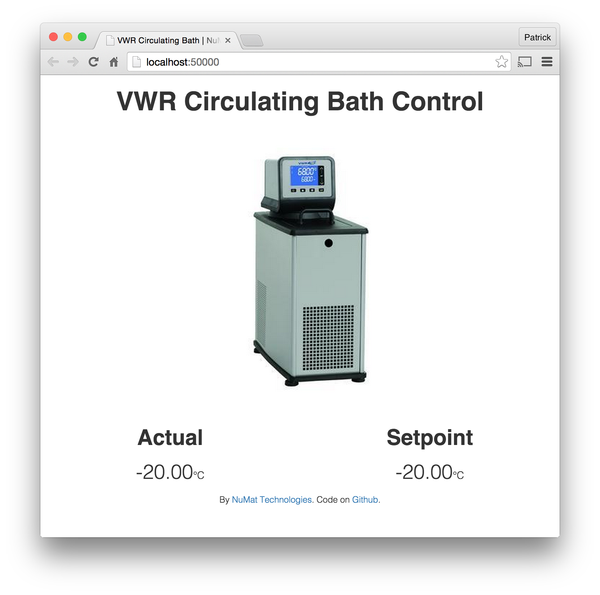

vwr
===

Web interface and Python bindings for [VWR circulating baths](https://us.vwr.com/store/catalog/product.jsp?catalog_number=89203-002).

<p align="center">
  
</p>

This was created to support older circulating baths (before touch screen models).
These older devices have ethernet ports, but only support serial communication
over UDP. This code provides the missing web interface by translating browser
interaction into serial commands.

Usage
=====

###Web Server



For temperature control models without a built-in web interface, this provides
the same functionality. Run the server with:

```
vwr [ip-address]
```

This should open a browser to http://localhost:10000/. Temperatures can be set
by clicking on and overwriting the displayed setpoint.

You can set a password with `vwr [ip] --set-password`, and serve a login page
with `vwr [ip] --require-login`. For more, check out the help with `vwr --help`.

###Python

For complex interaction, use this as part of a Python script.

```python
from vwr import CirculatingBath
bath = CirculatingBath("192.168.1.100")
print(bath.get_setpoint())
```

Only some functionality is currently implemented. We will expand this as needed.
